# Google Cloud NCC & VM-Series Tutorial

This tutorial demonstrates how to perform cross-region failover by connecting Palo Alto Networks VM-Series Firewalls as a router appliance spoke to a Network Connectivity Center hub. Beyond cross-region failover, using the VM-Series as a router appliance spoke supports a variety of other use cases, including:

* Connecting remote networks to Google Cloud while providing full BGP route exchange.
* Creating a global WAN network secured with VM-Series deployed in Google Cloud.
* Facilitating cross-region or disaster recovery network operations with regionally dispersed VM-Series.

This tutorial is intended for network administrators, solution architects, and security professionals who are familiar with [Compute Engine](https://cloud.google.com/compute) and [Virtual Private Cloud (VPC) networking](https://cloud.google.com/vpc).


## Architecture

Below is a diagram of the tutorial.  


Three VPCs are created (`mgmt`, `untrust`, and `vpc1`), each containing a subnet across the `us-east1` and `us-west1` regions. A VM-Series firewall is deployed in each region (`us-east1-vmseries` and `us-west1-vmseries`), with interfaces in each VPC. The firewall's interface in `vpc1` is configured as a router appliance spoke connected to a Network Connectivity Center hub.

In each region, the firewall is a BGP peer with a Cloud Router in the same region, enabling dynamic route exchange between the firewalls and the VPC route table. A default route is propagated from both firewalls to the `vpc1` route table, steering workload traffic through the firewall in the workload's region. In the event of a regional failure, traffic from the affected region automatically fails over to the firewall in the healthy region through dynamic route propagation.


| VPC       | Description                                                                                                                                                                                                           |
| --------- | --------------------------------------------------------------------------------------------------------------------------------------------------------------------------------------------------------------------- |
| `untrust` | Contains the VM-Series untrust dataplane interfaces.  Both outbound & inbound internet traffic from `vpc1` traverses this interface.                                                                                  |
| `mgmt`    | Contains the VM-Series maagement interfaces.  This interface provides access to the firewall's user interface and terminal console.                                                                                   | 
| `vpc1`    | Contains the VM-Series trust dataplane interfaces.  These interfaces are BGP peers with a cloud router in each region where routes are exchanged to steer workload traffic to the VM-Series firewalls.                |


## Requirements

The following is required for this tutorial:

1. A Google Cloud project. 
2. A machine with Terraform version:`"~> 1.7"`

> [!NOTE]
> This tutorial assumes you are using Google Cloud Shell. 


## Prepare for Deployment

1. Enable the required APIs and clone the repository. 

    ```
    gcloud services enable compute.googleapis.com
    git clone https://github.com/PaloAltoNetworks/google-cloud-hub-spoke-tutorial
    cd google-cloud-hub-spoke-tutorial
    ```

2. Generate an SSH key.

    ```
    ssh-keygen -f ~/.ssh/vmseries-tutorial -t rsa
    ```

3. Create a `terraform.tfvars` file.

    ```
    cp terraform.tfvars.example terraform.tfvars
    ```

4. Edit the `terraform.tfvars` file and set values for the following variables:

    | Key                         | Value                                                                                | Default                        |
    | --------------------------- | ------------------------------------------------------------------------------------ | ------------------------------ |
    | `project_id`                | The Project ID within Google Cloud.                                                  | `null`                         |
    | `public_key_path`           | The local path of the public key you previously created                              | `~/.ssh/vmseries-tutorial.pub` |
    | `mgmt_allow_ips`            | A list of IPv4 addresses which have access to the VM-Series management interface.    | `["0.0.0.0/0"]`                |
    | `create_spoke_networks`     | Set to `false` if you do not want to create the workload virtual machines.           | `true`                         |
    | `vmseries_image_name`       | Set to the VM-Series image you want to deploy.                                       | `vmseries-flex-bundle2-1022h2` |

> [!TIP]
> For `vmseries_image_name`, a full list of public images can be found with this command:
> ```
> gcloud compute images list --project paloaltonetworksgcp-public --filter='name ~ .*vmseries-flex.*'
> ```

> [!NOTE]
> If you are using BYOL image (i.e. `vmseries-flex-byol-*`), the license can be applied during or after deployment.  To license during deployment, add your VM-Series Authcodes to `bootstrap_files/authcodes`.  See [VM-Series Bootstrap Methods](https://docs.paloaltonetworks.com/vm-series/11-1/vm-series-deployment/bootstrap-the-vm-series-firewall) for more information.


### Deploy

When no further changes are necessary in the configuration, deploy the resources.

1. Initialize and apply the Terraform plan.  

    ```
    terraform init
    terraform apply
    ```

2. Enter `yes` to create the resources.

3. After all the resources are created, Terraform displays the following message:

    ```
    Apply complete!

    Outputs:

    SSH_VMSERIES_REGION1 = "ssh admin@<EXTERNAL_IP> -i ~/.ssh/vmseries-tutorial"
    SSH_VMSERIES_REGION2 = "ssh admin@<EXTERNAL_IP> -i ~/.ssh/vmseries-tutorial"
    SSH_WORKLOAD_VM_REGION1 = "gcloud compute ssh paloalto@us-central1-vm --zone=us-central1-a"
    SSH_WORKLOAD_VM_REGION2 = "gcloud compute ssh paloalto@us-east4-vm --zone=us-east4-a"
    ```

> [!IMPORTANT]
> It may take an additional 10 minutes for the firewalls to become fully available. 

## Access the VM-Series firewall

To access the VM-Series user interface, a password must be set for the `admin` user on each firewall.

1. Use the `SSH_VMSERIES_REGION1` output to SSH to the mgmt NIC on `us-east1-vmseries`.

2. On the VM-Series, set a password for the `admin` username. 

    ```
    configure
    set mgt-config users admin password
    ```

4. Commit the changes.

    ```
    commit
    ```

5. Enter `exit` twice to terminate the session.

6. Log in to the VM-Series web interface using the username `admin` and your password.

    ```
    https://<EXTERNAL_IP>
    ```

7. Repeat the process for `us-west1-vmseries` by using the `SSH_VMSERIES_REGION2` output value. 


## Verify Configuration

Confirm the VM-Series and Cloud Routers are connected via BGP peering.  Then, verify routes are being exchanged over the peering connections.

>[!NOTE]
> The Terraform plan creates the Cloud Routers for each region within `vpc1`.  It also bootstraps the VM-Series with a configuration to automatically establish BGP with the cloud routers. 

### Review VM-Series BGP Configuration
View the VM-Series BGP configuration and review the progated routes to the Cloud Routers in each region. 

1. On each VM-Series, go to **Network → Virtual Routers**. 

2. Next to the `gcp-vr`, select **More Runtime Stats**.

    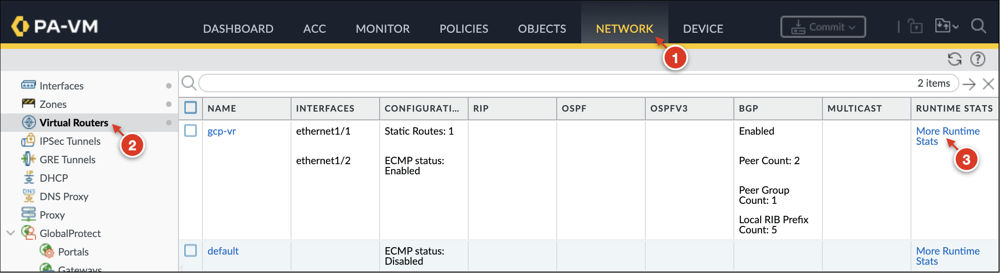

    > :bulb: **Information** <br> 
    > The virtual router contains all of routing configurations on the VM-Series.  To view the BGP configuration, open `gcp-vr` and select the **BGP** tab.
    <br>

3. Go to **BGP → Peer** to view the status of the BGP peering sessions with each region's cloud router.

    <figure>
    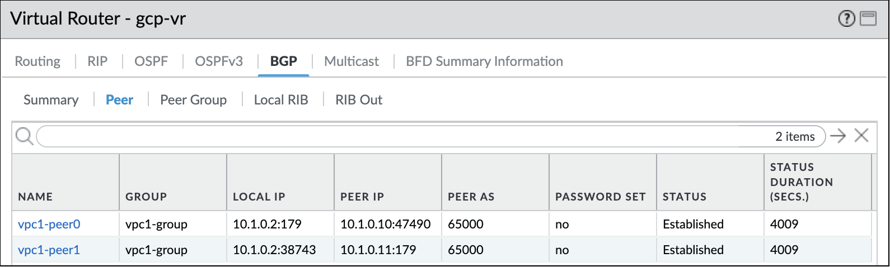
    <figcaption>us-east-vmseries</figcaption>
    </figure>

    <figure>
    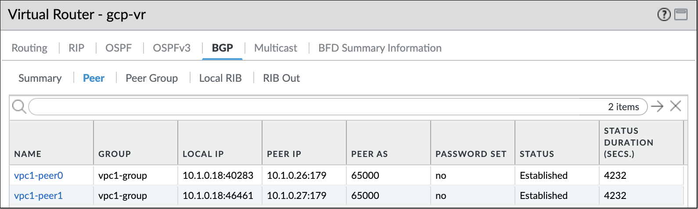
    <figcaption>us-west-vmseries</figcaption>
    </figure>

    > :bulb: **Information** <br> 
    > Both connections should be listed as `Established`.
    <br>

4. Click **Local RIB** to view the routing information the firewall has learned and selected for use.

    <figure>
    
    <figcaption>us-east-vmseries</figcaption>
    </figure>

    <figure>
    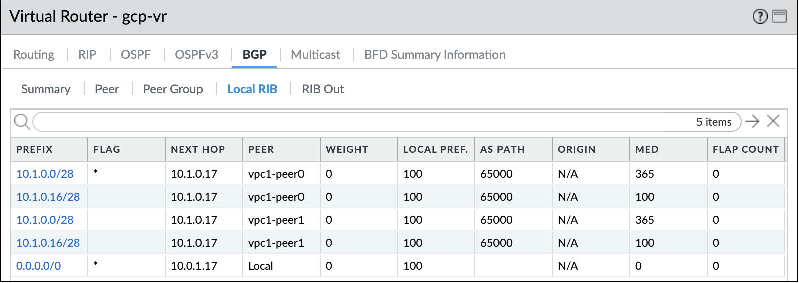
    <figcaption>us-west-vmseries</figcaption>
    </figure>

    > :bulb: **Information** <br> 
    > Routes with the `*` flag are preferred routes. 
    <br>

4. Click **RIB Out** to view the routes exported by the VM-Series to the Cloud Routers.

    <figure>
    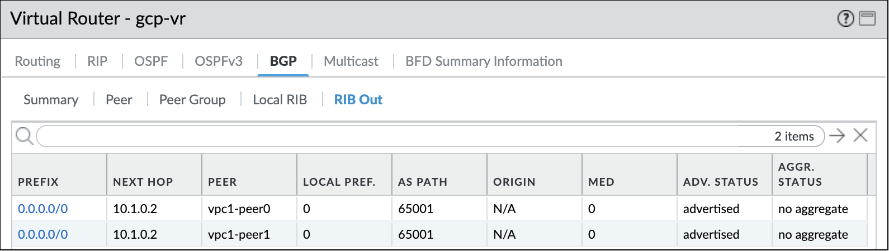
    <figcaption>us-east-vmseries</figcaption>
    </figure>

    <figure>
    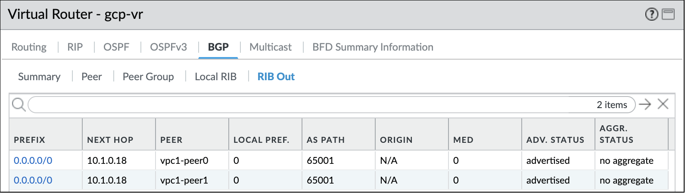
    <figcaption>us-west-vmseries</figcaption>
    </figure>

    > :bulb: **Information** <br> 
    > Both firewalls should be exporting 2 default routes for each of their BGP peers.

### Review Network Connectivity Center Configuration
View the connection status of the Cloud Router's BGP peers to the VM-Series firewalls in each region.  

1. In Google Cloud, go to **Network Connectivity → Network Connectivity Center**. 

2. Click **Spokes** and select the `vmseries-us-east1-spoke` router appliance spoke.

    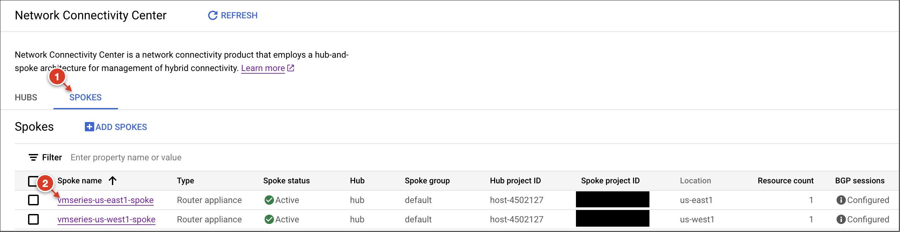

2. Open the BGP session name for both `peer0` and `peer1` to view the session's status and advertised routes from the Cloud Router to the VM-Series. 

    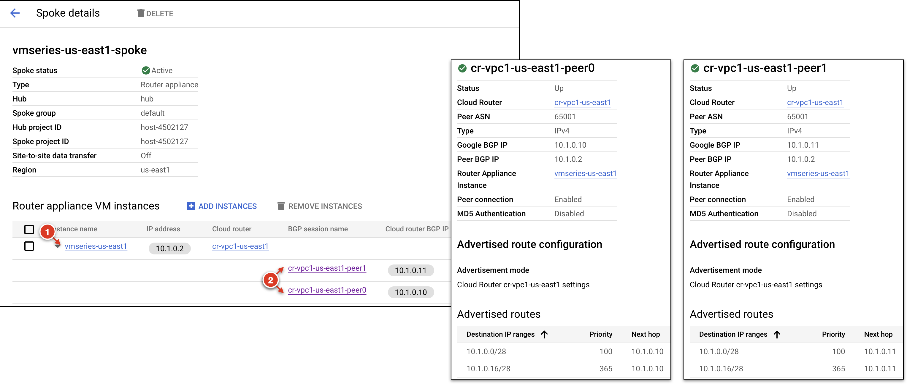

    > :bulb: **Information** <br> 
    > The Cloud Router in each region automatically propagates subnet routes to the VM-Series firewalls.
    <br>

3. Repeat the process for the `vmseries-us-west1-spoke` router appliance spoke.


### Review VPC Route Table
View the routes propagated by the VM-Series to the route table of `vpc1` for both regions.

1. In Google Cloud, go to **VPC Network → Routes → Effective Routes**.

2. To view the effective routes for `us-east1`, set **Network** to `vpc1` and **Region** to `us-east1`.
    
    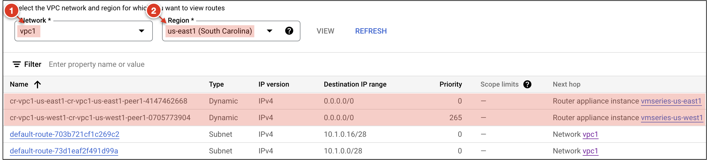
    
    > :bulb: **Information** <br> 
    > The preferred default route (priority `0`) for `us-east1` uses the `us-east1-vmseries` as the next hop.
    <br>

3. Set the **Region** to `us-west1` to view the effective routes for `us-west1` traffic.

    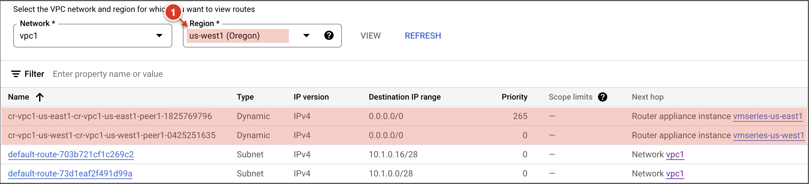

    > :bulb: **Information** <br> 
    > The preferred default route (priority `0`) for `us-west1` traffic uses the `us-west1-vmseries` as the next hop.
    <br>

## Simulate Cross-Region Failover
Access the workload VMs in each region and initiate outbound traffic.  Then, simulate a regional failure event by terminating the BGP connectivity on one of the firewalls. 

### Generate Outbound Traffic
Verify traffic originating from `us-east1` travereses the `us-east1-vmseries` and traffic originating from `us-west1` traverses the `us-west1-vmseries`.  

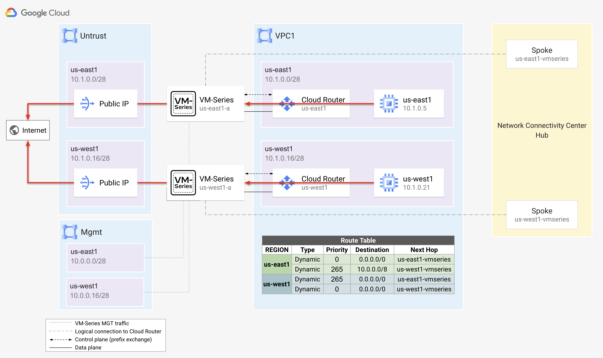

> [!NOTE]
> You can redisplay the Terraform output values at anytime by running `terraform output` from the `google-cloud-vmseries-ncc-tutorial` directory. 

1. Open two new Cloud Shell tabs (:heavy_plus_sign:). 

2. In the first tab, paste the `SSH_WORKLOAD_VM_REGION1` output to SSH to `us-east1-vm` (`10.1.0.5`) in `vpc1`.

2. In the second tab, paste the `SSH_WORKLOAD_VM_REGION2` output to SSH to `us-west1-vm` (`10.1.0.21`) in `vpc1`.

4. On each VM, run a continuous ping to an internet address.

    ```
    ping 4.2.2.2
    ```

> [!IMPORTANT]
> Keep the pings running for the duration of the tutorial.**

5. On each VM-Series, go to **Monitor → Traffic** and enter the following traffic filter.

    ```
    ( zone.src eq 'vpc1' ) and ( addr.dst in '4.2.2.2' )
    ```

    <figure>
    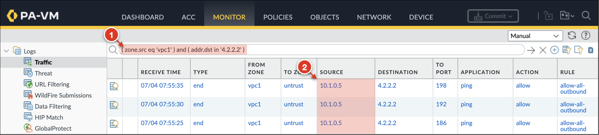
    <figcaption>us-east-vmseries</figcaption>
    </figure>

    <figure>
    
    <figcaption>us-west-vmseries</figcaption>
    </figure>

    > :bulb: **Information** <br> 
    > You should see that traffic from `us-east1-vm` (`10.1.0.5`) uses the preferred route to  `us-east1-vmseries` and traffic from `us-west1-vm` (`10.1.0.21`) uses the firewall in `us-west1`. 
    <br>


### Simulate Failover
Simulate a `us-east1` failure event by disabling BGP on the `us-east1-vmseries`. After failover, the dynamic routes using `us-east1-vmseries` as the next hop should coverge to use to use `us-west1-vmseries`.

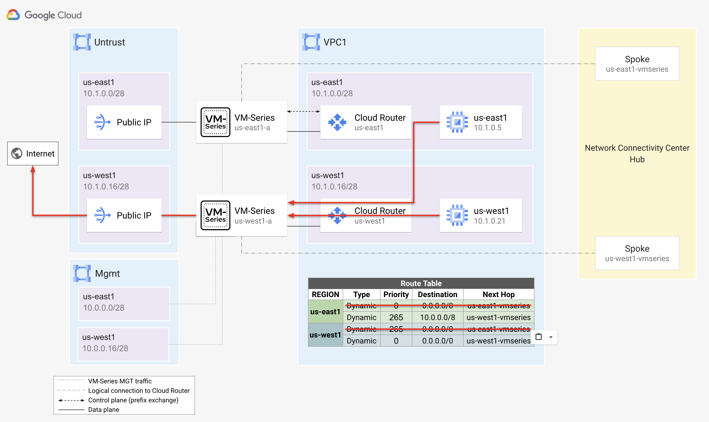

1. On `us-east1-vmseries`, go to **Network → Virtual Routers** and select `gcp-vr`.

2. Click to **BGP** and uncheck **Enable** and click **OK**.

    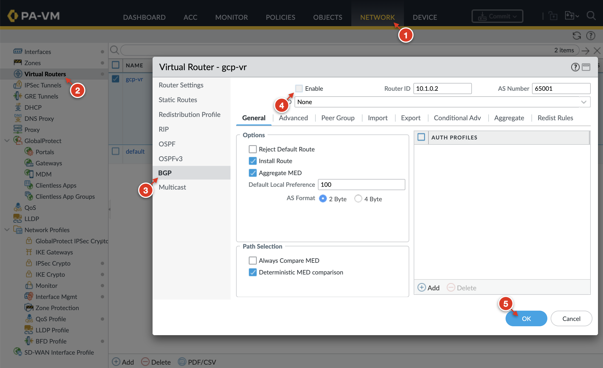

3. In the top right corner, click **Commit → Commit** to apply the changes. 

4. Wait for the commit to complete.


### Review VPC Route Table & VM-Series Traffic logs
Verify the `vpc1` route table has been updated to route `us-east1` traffic through the `us-west1-vmseries`.

1. In Google Cloud, go to **VPC Network → Routes → Effective Routes**.

2. Set **Network** to `vpc1` and **Region** to `us-east1`.
    
    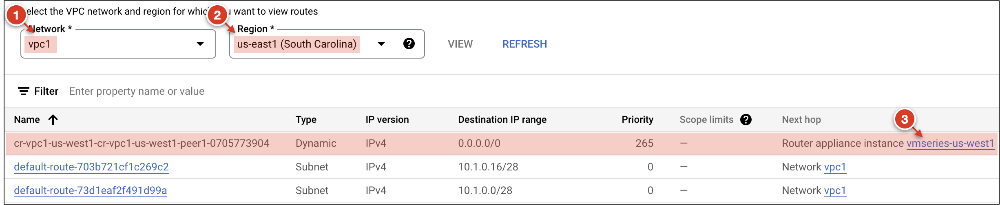

    > :bulb: **Information** <br>
    > The route table for `us-east1` traffic should now have a default route using `us-west1-vmseries` as the next hop. 
    <br>

3. On `us-west1-vmseries`, go to **Monitor → Traffic**. 

    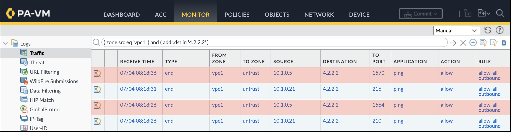

    > :bulb: **Information** <br>
    > The pings from `us-east1-vm` (`10.1.0.5`) should now appear within the `us-west1-vmseries` traffic logs. 
    <br>

> [!IMPORTANT]
> In production environments, it is recommended to have multiple firewalls deployed across different zones within each region.  This approach offers higher redundancy for intra-region failure events.

## Clean up

Delete all the resources when you no longer need them.

1. In Cloud Shell, run the following to delete all the created resources.

    ```
    terraform destroy
    ```

2. At the prompt to perform the actions, enter `yes`. 
   
   After all the resources are deleted, Terraform displays the following message:

    ```
    Destroy complete!
    ```

## Additional information

* Learn about the[ VM-Series on Google Cloud](https://docs.paloaltonetworks.com/vm-series/10-2/vm-series-deployment/set-up-the-vm-series-firewall-on-google-cloud-platform/about-the-vm-series-firewall-on-google-cloud-platform).
* Getting started with [Palo Alto Networks PAN-OS](https://docs.paloaltonetworks.com/pan-os). 
* Read about [securing Google Cloud Networks with the VM-Series](https://cloud.google.com/architecture/partners/palo-alto-networks-ngfw).
* Learn about [VM-Series licensing on all platforms](https://docs.paloaltonetworks.com/vm-series/10-2/vm-series-deployment/license-the-vm-series-firewall/vm-series-firewall-licensing.html#id8fea514c-0d85-457f-b53c-d6d6193df07c).
* Use the [VM-Series Terraform modules for Google Cloud](https://registry.terraform.io/modules/PaloAltoNetworks/vmseries-modules/google/latest). 